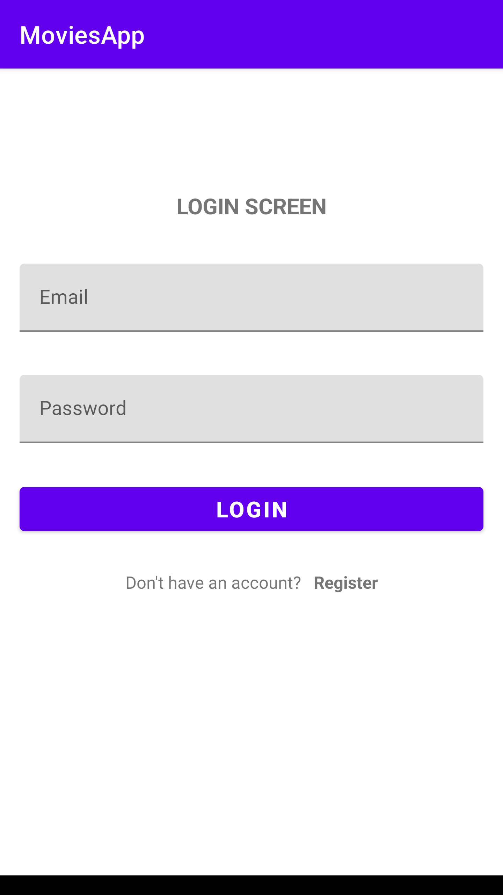
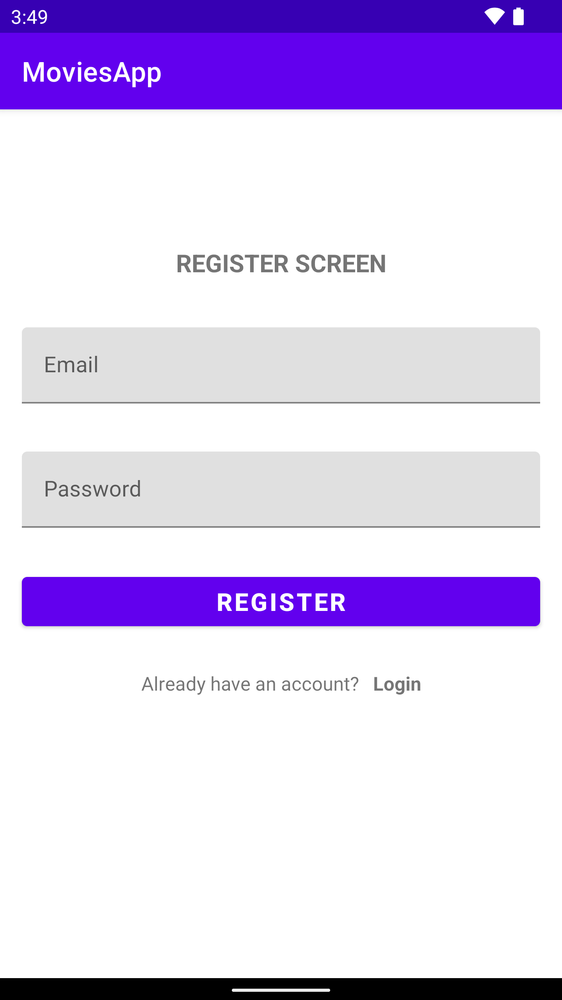
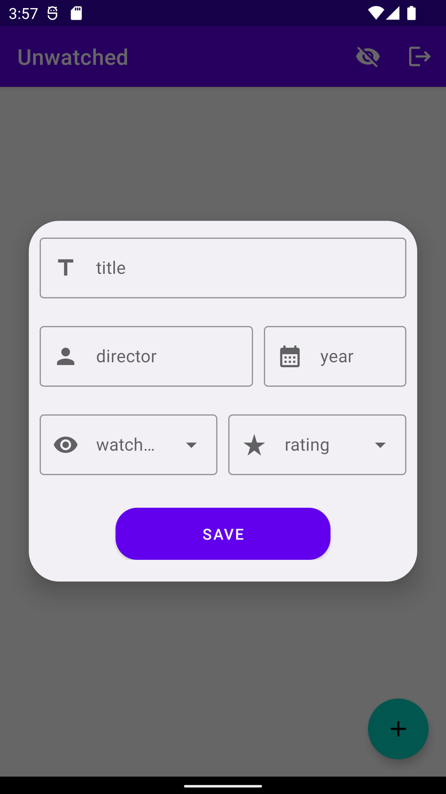
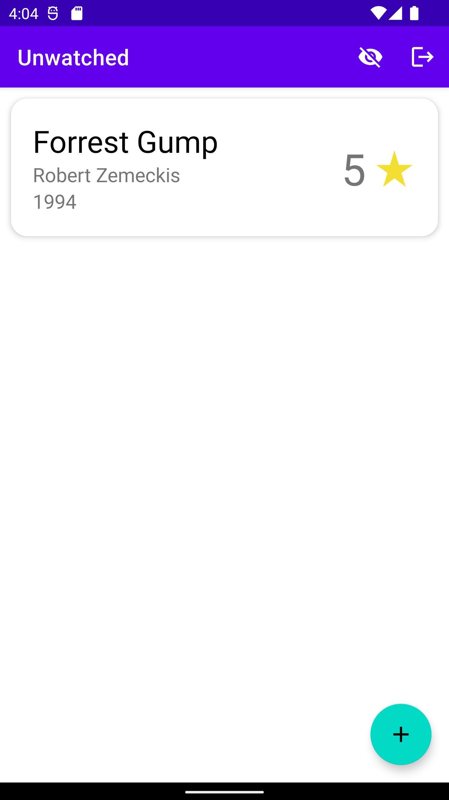

# MoviesApp
Application to save the titles of movies. It splits movies into watched and unwatched. It uses the Firebase toolkit, so it includes a registration and login module. Added movies are saved using Realtime Database.
## Tools
Kotlin, MVVM, Firebase Authentication, Firebase Realtime Database
## Screenshots

